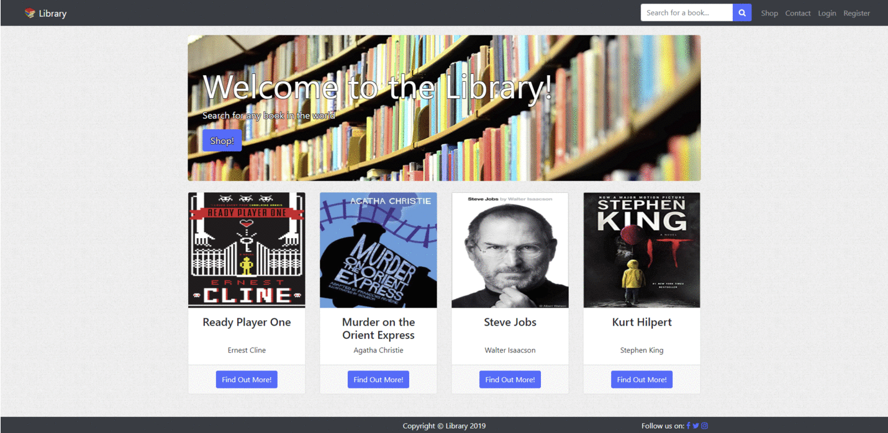

# Library


Website created to act as a template for a bookstore, although it can easily be modified to fit any type of online store.

# Tech/Frameworks used
- Laravel
- HTML, CSS, JS
- MySQL

# How to use locally

Download:
- [VirtualBox](https://www.virtualbox.org/wiki/Downloads)
- [Vagrant](https://www.vagrantup.com/)
- [Composer](https://getcomposer.org/)

After installing vagrant run `vagrant box add laravel/homestead` in your terminal.

Next, you need to clone homestead to your home folder so you can use one config for all of your projects. <br>Run `git clone https://github.com/laravel/homestead.git ~/Homestead`, then `bash init.sh` to create Homestead.yaml configuration file.

You will use this config file to share your projects to your Homestead environment. You may configure as many shared folders as necessary.<br>
Example:
```yaml
folders:
    - map: ~/library # folder on your machine that you want to share
      to: /home/vagrant/library # folder on vm
```

The same should be done for sites. Add as many custom domains as you want and map them to corresponding folders.<br>
Example:
```yaml
sites:
    - map: library.test # custom domain
      to: /home/vagrant/library/public # folder on vm (usually folder with index.html file)

    - map: phpmyadmin.test
      to: /home/vagrant/library/phpmyadmin
```

Add domains to your `/etc/hosts` file with the ip address you set in Homestead.yaml.<br>
Example:
```hosts
    192.168.1.10    library.test
    192.168.1.10    phpmyadmin.test
```
Git clone this repository `git clone https://github.com/bojangabric/library.git` and change the credentials in `.env.example` file (change DB_HOST to previously set ip address) and rename it to `.env`. <br>Run `composer install` in library folder to install all dependencies that are in `composer.json`. Change the ip address in [resources/views/auth/admin/getTableData.blade.php](resources/views/auth/admin/getTableData.blade.php) to one you set in Homestead.yaml.

Once you have edited the Homestead.yaml to your liking, run the `vagrant up` command from your Homestead directory. Vagrant will boot the virtual machine and automatically configure your shared folders and Nginx sites.

For more info check [Laravel's official site](https://laravel.com/docs/5.7/homestead).

# Filling up database

Run `php artisan migrate` to create schemas in your database using migrations in [/database/migrations](/database/migrations).

After creating schemas run `php artisan db:seed --class=CategoriesTableSeeder` to create categories for books.

## License
See the [LICENSE](LICENSE) file for license rights and limitations (MIT).
